# CNC Tools - Schemat Bazy Danych

**Wersja aplikacji:** 1.00.0g
**Baza danych:** PostgreSQL
**Framework:** Django 4.2
**Aplikacja:** TOOLS
**Data generacji:** 2026-02-24

---

## Spis treści

1. [Kategoria](#1-kategoria)
2. [Podkategoria](#2-podkategoria)
3. [Dostawca](#3-dostawca)
4. [Lokalizacja](#4-lokalizacja)
5. [Maszyna](#5-maszyna)
6. [Pracownik](#6-pracownik)
7. [FakturaZakupu](#7-fakturazakupu)
8. [NarzedzieMagazynowe](#8-narzedziemagazynowe)
9. [EgzemplarzNarzedzia](#9-egzemplarznarzedzia)
10. [HistoriaUzyciaNarzedzia](#10-historiauzycianarzeadzia)
11. [Uszkodzenie](#11-uszkodzenie)
12. [Zamowienie](#12-zamowienie)
13. [PozycjaZamowienia](#13-pozycjazamowienia)
14. [RealizacjaZamowienia](#14-realizacjazamowienia)
15. [PozycjaRealizacji](#15-pozycjarealizacji)
16. [PozycjaGeneratora](#16-pozycjageneratora)
17. [ZapotrzebowanieTechnologa](#17-zapotrzebowanietechnologa)
18. [PozycjaZapotrzebowania](#18-pozycjazapotrzebowania)
19. [LogEntry](#19-logentry)

---

## Diagram relacji (Mermaid ER)

> Diagram renderuje się automatycznie na GitHubie. Legenda oznaczeń:
> `||` = dokładnie jeden (wymagany), `|o` = zero lub jeden (opcjonalny), `o{` = zero lub wiele, `|{` = jeden lub wiele

```mermaid
erDiagram
    %% ══════════ SŁOWNIKI ══════════
    Kategoria {
        bigint id PK
        varchar nazwa UK "UNIQUE"
    }

    Podkategoria {
        bigint id PK
        varchar nazwa
        bigint kategoria_id FK
    }

    Dostawca {
        bigint id PK
        varchar kod_dostawcy UK "UNIQUE"
        varchar nazwa_firmy
        varchar nip
        varchar telefon
        varchar email
    }

    Lokalizacja {
        bigint id PK
        varchar szafa
        varchar kolumna
        varchar polka
    }

    Maszyna {
        bigint id PK
        varchar nazwa UK "UNIQUE"
    }

    Pracownik {
        bigint id PK
        varchar karta UK "UNIQUE"
        varchar nazwisko
        varchar imie
        bigint user_id FK "OneToOne, SET_NULL"
        boolean pobieranie_narzedzi
    }

    %% ══════════ MAGAZYN ══════════
    NarzedzieMagazynowe {
        bigint id PK
        bigint podkategoria_id FK "SET_NULL"
        text opis
        varchar numer_katalogowy
        int stan_minimalny
        int stan_maksymalny
        bigint ostatni_dostawca_id FK "SET_NULL"
        bigint domyslna_lokalizacja_id FK "SET_NULL"
        varchar opakowanie "szt lub kompl"
        int ilosc_w_opakowaniu
        boolean wydawanie_sztuk
    }

    EgzemplarzNarzedzia {
        bigint id PK
        bigint narzedzie_typ_id FK "CASCADE"
        varchar stan "nowe uzywane uszkodzone"
        bigint lokalizacja_id FK "SET_NULL"
        bigint faktura_zakupu_id FK "SET_NULL"
        bigint zamowienie_id FK "SET_NULL"
        datetime data_zakupu
        datetime data_modyfikacji
        varchar oznaczenie
        varchar jednostka "szt lub kompl"
        int ilosc_w_komplecie
        bigint komplet_zrodlowy_id FK "self SET_NULL"
        boolean nowy_wpis
    }

    HistoriaUzyciaNarzedzia {
        bigint id PK
        bigint egzemplarz_id FK "CASCADE"
        bigint maszyna_id FK "SET_NULL"
        bigint pracownik_id FK "SET_NULL"
        bigint pracownik_zwracajacy_id FK "SET_NULL"
        datetime data_wydania
        datetime data_zwrotu
        text uwagi
        varchar nr_zlecenia
        varchar stan_po_zwrocie
    }

    %% ══════════ USZKODZENIA ══════════
    Uszkodzenie {
        bigint id PK
        bigint egzemplarz_id FK "SET_NULL"
        bigint narzedzie_typ_id FK "CASCADE"
        bigint pracownik_id FK "SET_NULL"
        varchar numer_karty UK "UNIQUE RRRR-NNN"
        datetime data_uszkodzenia
        text opis_uszkodzenia
        text przyczyna_uszkodzenia
        varchar stracony_czas
    }

    %% ══════════ FAKTURY ══════════
    FakturaZakupu {
        bigint id PK
        varchar numer_faktury UK "UNIQUE"
        date data_wystawienia
        bigint dostawca_id FK "PROTECT"
        file plik
        boolean rozliczone
    }

    %% ══════════ ZAMÓWIENIA ══════════
    Zamowienie {
        bigint id PK
        varchar numer UK "UNIQUE"
        bigint dostawca_id FK "PROTECT"
        varchar email_docelowy
        datetime data_utworzenia
        datetime data_wyslania
        decimal wartosc_zamowienia "12 i 2"
        varchar status "draft verified sent received completed"
        text uwagi
    }

    PozycjaZamowienia {
        bigint id PK
        bigint zamowienie_id FK "CASCADE"
        bigint narzedzie_typ_id FK "PROTECT"
        int ilosc_zamowiona
        varchar jednostka
        decimal cena_jednostkowa "10 i 2"
        decimal wartosc_pozycji "12 i 2"
        int ilosc_dostarczona
        boolean zrealizowane
    }

    RealizacjaZamowienia {
        bigint id PK
        bigint zamowienie_id FK "CASCADE"
        datetime data_realizacji
        bigint lokalizacja_domyslna_id FK "SET_NULL"
        text uwagi
    }

    PozycjaRealizacji {
        bigint id PK
        bigint realizacja_id FK "CASCADE"
        bigint pozycja_zamowienia_id FK "CASCADE"
        int ilosc_przyjeta
        bigint lokalizacja_id FK "SET_NULL"
        bigint faktura_zakupu_id FK "SET_NULL"
        decimal cena_jednostkowa "10 i 2"
    }

    %% ══════════ GENERATOR ZAMÓWIEŃ ══════════
    PozycjaGeneratora {
        bigint id PK
        bigint narzedzie_typ_id FK "OneToOne CASCADE"
        bigint dostawca_id FK "SET_NULL"
        decimal cena_jednostkowa "10 i 2"
        int ilosc_do_zamowienia
        datetime data_utworzenia
        datetime data_modyfikacji
    }

    %% ══════════ ZAPOTRZEBOWANIA ══════════
    ZapotrzebowanieTechnologa {
        bigint id PK
        bigint technolog_id FK "SET_NULL User"
        datetime data_utworzenia
        datetime data_wyslania
        datetime data_realizacji
        bigint zrealizowany_przez_id FK "SET_NULL User"
        varchar status "draft submitted completed cancelled"
        text uwagi
    }

    PozycjaZapotrzebowania {
        bigint id PK
        bigint zapotrzebowanie_id FK "CASCADE"
        bigint narzedzie_typ_id FK "SET_NULL"
        varchar specyfikacja
        varchar numer_katalogowy
        varchar nr_klienta
        varchar nr_zlecenia
        int ilosc
        text uwagi
        datetime data_dodania
    }

    %% ══════════ LOGI ══════════
    LogEntry {
        bigint id PK
        datetime timestamp "db_index"
        varchar status "INFO SUCCESS WARNING ERROR"
        varchar osoba
        text operacja
    }

    %% ══════════ AUTH (Django) ══════════
    User {
        int id PK
        varchar username UK
        varchar first_name
        varchar last_name
        varchar email
    }

    %% ╔══════════════════════════════════════════╗
    %% ║            R E L A C J E                 ║
    %% ╚══════════════════════════════════════════╝

    %% --- Hierarchia kategorii ---
    Kategoria ||--o{ Podkategoria : "zawiera"
    Podkategoria |o--o{ NarzedzieMagazynowe : "zawiera"

    %% --- Narzędzie magazynowe - powiązania słownikowe ---
    Dostawca |o--o{ NarzedzieMagazynowe : "ostatni dostawca"
    Lokalizacja |o--o{ NarzedzieMagazynowe : "domyslna lokalizacja"

    %% --- Egzemplarze narzędzi ---
    NarzedzieMagazynowe ||--o{ EgzemplarzNarzedzia : "typ narzedzia"
    Lokalizacja |o--o{ EgzemplarzNarzedzia : "aktualna lokalizacja"
    FakturaZakupu |o--o{ EgzemplarzNarzedzia : "faktura zakupu"
    Zamowienie |o--o{ EgzemplarzNarzedzia : "zamowienie zrodlowe"
    EgzemplarzNarzedzia |o--o{ EgzemplarzNarzedzia : "komplet zrodlowy"

    %% --- Historia użycia ---
    EgzemplarzNarzedzia ||--o{ HistoriaUzyciaNarzedzia : "historia uzycia"
    Maszyna |o--o{ HistoriaUzyciaNarzedzia : "maszyna"
    Pracownik |o--o{ HistoriaUzyciaNarzedzia : "pobierajacy"
    Pracownik |o--o{ HistoriaUzyciaNarzedzia : "zwracajacy"

    %% --- Uszkodzenia ---
    EgzemplarzNarzedzia |o--o{ Uszkodzenie : "uszkodzony egzemplarz"
    NarzedzieMagazynowe |o--o{ Uszkodzenie : "typ narzedzia"
    Pracownik |o--o{ Uszkodzenie : "zglaszajacy"

    %% --- Faktury ---
    Dostawca ||--o{ FakturaZakupu : "wystawca faktury"

    %% --- Zamówienia ---
    Dostawca ||--o{ Zamowienie : "dostawca"
    Zamowienie ||--o{ PozycjaZamowienia : "pozycje zamowienia"
    NarzedzieMagazynowe ||--o{ PozycjaZamowienia : "zamawiane narzedzie"

    %% --- Realizacje zamówień ---
    Zamowienie ||--o{ RealizacjaZamowienia : "realizacje"
    Lokalizacja |o--o{ RealizacjaZamowienia : "lokalizacja domyslna"
    RealizacjaZamowienia ||--o{ PozycjaRealizacji : "pozycje realizacji"
    PozycjaZamowienia ||--o{ PozycjaRealizacji : "realizacja pozycji"
    Lokalizacja |o--o{ PozycjaRealizacji : "lokalizacja docelowa"
    FakturaZakupu |o--o{ PozycjaRealizacji : "faktura"

    %% --- Generator zamówień ---
    NarzedzieMagazynowe ||--|| PozycjaGeneratora : "pozycja generatora"
    Dostawca |o--o{ PozycjaGeneratora : "dostawca"

    %% --- Zapotrzebowania technologów ---
    User |o--o{ ZapotrzebowanieTechnologa : "technolog"
    User |o--o{ ZapotrzebowanieTechnologa : "realizujacy"
    ZapotrzebowanieTechnologa ||--o{ PozycjaZapotrzebowania : "pozycje"
    NarzedzieMagazynowe |o--o{ PozycjaZapotrzebowania : "narzedzie"

    %% --- Auth ---
    User |o--o| Pracownik : "konto uzytkownika"
```

---

## Tabele

### 1. Kategoria
**Opis:** Główne kategorie narzędzi

| Pole | Typ | Ograniczenia | Opis |
|------|-----|-------------|------|
| id | BigAutoField | PK, auto | Klucz główny |
| nazwa | CharField(100) | UNIQUE, NOT NULL | Nazwa kategorii |

**Meta:** ordering = ['nazwa']

---

### 2. Podkategoria
**Opis:** Podkategorie w ramach kategorii

| Pole | Typ | Ograniczenia | Opis |
|------|-----|-------------|------|
| id | BigAutoField | PK, auto | Klucz główny |
| nazwa | CharField(100) | NOT NULL | Nazwa podkategorii |
| kategoria | ForeignKey → Kategoria | CASCADE, NOT NULL | Kategoria nadrzędna |

**Meta:** unique_together = [('nazwa', 'kategoria')], ordering = ['kategoria__nazwa', 'nazwa']

---

### 3. Dostawca
**Opis:** Dostawcy narzędzi

| Pole | Typ | Ograniczenia | Opis |
|------|-----|-------------|------|
| id | BigAutoField | PK, auto | Klucz główny |
| kod_dostawcy | CharField(50) | UNIQUE, NOT NULL | Kod dostawcy |
| nazwa_firmy | CharField(200) | NOT NULL | Nazwa firmy |
| nip | CharField(20) | NULL, BLANK | NIP |
| adres | TextField | NULL, BLANK | Adres |
| telefon | CharField(20) | NULL, BLANK | Telefon |
| email | EmailField | NULL, BLANK | Email |

**Meta:** ordering = ['nazwa_firmy']

---

### 4. Lokalizacja
**Opis:** Lokalizacja magazynowa (szafa/kolumna/półka)

| Pole | Typ | Ograniczenia | Opis |
|------|-----|-------------|------|
| id | BigAutoField | PK, auto | Klucz główny |
| szafa | CharField(50) | NOT NULL | Szafa/regał |
| kolumna | CharField(50) | NOT NULL | Kolumna |
| polka | CharField(50) | NOT NULL | Półka |

**Meta:** unique_together = [('szafa', 'kolumna', 'polka')], ordering = ['szafa', 'kolumna', 'polka']

---

### 5. Maszyna
**Opis:** Maszyny CNC

| Pole | Typ | Ograniczenia | Opis |
|------|-----|-------------|------|
| id | BigAutoField | PK, auto | Klucz główny |
| nazwa | CharField(100) | UNIQUE, NOT NULL | Nazwa maszyny |

**Meta:** ordering = ['nazwa']

---

### 6. Pracownik
**Opis:** Pracownicy

| Pole | Typ | Ograniczenia | Opis |
|------|-----|-------------|------|
| id | BigAutoField | PK, auto | Klucz główny |
| karta | CharField(50) | UNIQUE, NULL, BLANK | Numer karty pracownika |
| nazwisko | CharField(100) | NOT NULL | Nazwisko |
| imie | CharField(100) | NOT NULL | Imię |
| user | OneToOneField → User | SET_NULL, NULL, BLANK | Konto Django |
| pobieranie_narzedzi | BooleanField | default=True | Czy może pobierać narzędzia |

**Meta:** ordering = ['nazwisko', 'imie']

---

### 7. FakturaZakupu
**Opis:** Faktury zakupu

| Pole | Typ | Ograniczenia | Opis |
|------|-----|-------------|------|
| id | BigAutoField | PK, auto | Klucz główny |
| numer_faktury | CharField(100) | UNIQUE, NOT NULL | Numer faktury |
| data_wystawienia | DateField | NOT NULL | Data wystawienia |
| dostawca | ForeignKey → Dostawca | PROTECT, NOT NULL | Dostawca |
| plik | FileField | NULL, BLANK, upload='faktury/' | Plik faktury |
| rozliczone | BooleanField | default=False | Czy rozliczona |

**Meta:** ordering = ['-data_wystawienia']

---

### 8. NarzedzieMagazynowe
**Opis:** Typy narzędzi w magazynie (kartoteka)

| Pole | Typ | Ograniczenia | Opis |
|------|-----|-------------|------|
| id | BigAutoField | PK, auto | Klucz główny |
| podkategoria | ForeignKey → Podkategoria | SET_NULL, NULL, BLANK | Podkategoria |
| opis | TextField | NOT NULL | Opis / specyfikacja |
| numer_katalogowy | CharField(100) | NULL, BLANK | Numer katalogowy |
| obraz | ImageField | NULL, BLANK, upload='narzedzia/' | Zdjęcie narzędzia |
| stan_minimalny | PositiveIntegerField | default=0 | Stan minimalny |
| stan_maksymalny | PositiveIntegerField | default=0 | Stan maksymalny |
| ostatni_dostawca | ForeignKey → Dostawca | SET_NULL, NULL, BLANK | Ostatni dostawca |
| domyslna_lokalizacja | ForeignKey → Lokalizacja | SET_NULL, NULL, BLANK | Domyślna lokalizacja |
| opakowanie | CharField(10) | choices: szt/kompl, default='szt' | Jednostka zakupu |
| ilosc_w_opakowaniu | PositiveIntegerField | default=1 | Ilość sztuk w opakowaniu |
| wydawanie_sztuk | BooleanField | default=False | Wydawanie pojedynczych sztuk |

**Meta:** ordering = ['podkategoria__kategoria__nazwa', 'podkategoria__nazwa', 'opis']

---

### 9. EgzemplarzNarzedzia
**Opis:** Pojedyncze egzemplarze narzędzi (stan magazynowy)

| Pole | Typ | Ograniczenia | Opis |
|------|-----|-------------|------|
| id | BigAutoField | PK, auto | Klucz główny |
| narzedzie_typ | ForeignKey → NarzedzieMagazynowe | CASCADE, NOT NULL | Typ narzędzia |
| stan | CharField(30) | choices: nowe/uzywane/uszkodzone/uszkodzone_regeneracja, default='nowe' | Stan egzemplarza |
| lokalizacja | ForeignKey → Lokalizacja | SET_NULL, NULL, BLANK | Aktualna lokalizacja |
| faktura_zakupu | ForeignKey → FakturaZakupu | SET_NULL, NULL, BLANK | Faktura zakupu |
| zamowienie | ForeignKey → Zamowienie | SET_NULL, NULL, BLANK | Zamówienie źródłowe |
| data_zakupu | DateTimeField | auto_now_add, NULL, BLANK | Data przyjęcia |
| data_modyfikacji | DateTimeField | auto_now | Data ostatniej modyfikacji |
| oznaczenie | CharField(100) | NULL, BLANK | Oznaczenie/etykieta |
| jednostka | CharField(10) | choices: szt/kompl, default='szt' | Jednostka |
| ilosc_w_komplecie | PositiveIntegerField | default=1 | Ilość w komplecie |
| komplet_zrodlowy | ForeignKey → self | SET_NULL, NULL, BLANK | Komplet źródłowy (self-ref) |
| nowy_wpis | BooleanField | default=False | Oczekuje na wydruk etykiety |

**Meta:** ordering = ['-data_zakupu']

---

### 10. HistoriaUzyciaNarzedzia
**Opis:** Historia wydań i zwrotów narzędzi

| Pole | Typ | Ograniczenia | Opis |
|------|-----|-------------|------|
| id | BigAutoField | PK, auto | Klucz główny |
| egzemplarz | ForeignKey → EgzemplarzNarzedzia | CASCADE, NOT NULL | Egzemplarz |
| maszyna | ForeignKey → Maszyna | SET_NULL, NULL | Maszyna |
| pracownik | ForeignKey → Pracownik | SET_NULL, NULL | Pracownik pobierający |
| pracownik_zwracajacy | ForeignKey → Pracownik | SET_NULL, NULL, BLANK | Pracownik zwracający |
| data_wydania | DateTimeField | auto_now_add, NOT NULL | Data wydania |
| data_zwrotu | DateTimeField | NULL, BLANK | Data zwrotu |
| uwagi | TextField | BLANK | Uwagi |
| nr_zlecenia | CharField(100) | NULL, BLANK | Nr zlecenia produkcyjnego |
| stan_po_zwrocie | CharField(30) | NULL, BLANK | Stan po zwrocie |

**Meta:** ordering = ['-data_wydania']

---

### 11. Uszkodzenie
**Opis:** Karty uszkodzeń narzędzi

| Pole | Typ | Ograniczenia | Opis |
|------|-----|-------------|------|
| id | BigAutoField | PK, auto | Klucz główny |
| egzemplarz | ForeignKey → EgzemplarzNarzedzia | SET_NULL, NULL, BLANK | Egzemplarz |
| narzedzie_typ | ForeignKey → NarzedzieMagazynowe | CASCADE, NULL, BLANK | Typ narzędzia |
| narzedzie_opis | CharField(500) | BLANK | Opis narzędzia (snapshot) |
| numer_katalogowy | CharField(200) | BLANK | Nr katalogowy (snapshot) |
| kategoria_narzedzia | CharField(300) | BLANK | Kategoria (snapshot) |
| lokalizacja_opis | CharField(200) | BLANK | Lokalizacja (snapshot) |
| stan | CharField(50) | BLANK | Stan (snapshot) |
| maszyna_nazwa | CharField(200) | BLANK | Maszyna (snapshot) |
| pracownik_nazwisko | CharField(100) | BLANK | Nazwisko pracownika |
| pracownik_imie | CharField(100) | BLANK | Imię pracownika |
| data_uszkodzenia | DateTimeField | auto_now_add | Data uszkodzenia |
| opis_uszkodzenia | TextField | NULL, BLANK | Opis uszkodzenia |
| pracownik | ForeignKey → Pracownik | SET_NULL, NULL, BLANK | Zgłaszający |
| numer_karty | CharField(15) | UNIQUE, NULL, BLANK | Nr karty (RRRR/NNN lub RRRR/NNNR) |
| przyczyna_uszkodzenia | TextField | BLANK | Przyczyna |
| stracony_czas | CharField(100) | BLANK | Stracony czas |
| typ_zglaszajacego | CharField(20) | BLANK | Typ: pobierajacy/zwracajacy |
| nazwisko_zglaszajacego | CharField(200) | BLANK | Nazwisko zgłaszającego |

**Meta:** ordering = ['-data_uszkodzenia']

---

### 12. Zamowienie
**Opis:** Zamówienia zakupu narzędzi

| Pole | Typ | Ograniczenia | Opis |
|------|-----|-------------|------|
| id | BigAutoField | PK, auto | Klucz główny |
| numer | CharField(50) | UNIQUE, NOT NULL | Numer zamówienia |
| dostawca | ForeignKey → Dostawca | PROTECT, NOT NULL | Dostawca |
| email_docelowy | EmailField | NULL, BLANK | Email dostawcy (snapshot) |
| data_utworzenia | DateTimeField | auto_now_add | Data utworzenia |
| data_wyslania | DateTimeField | NULL, BLANK | Data wysłania |
| wartosc_zamowienia | DecimalField(12,2) | default=0 | Wartość zamówienia |
| status | CharField(20) | choices: draft/verified/sent/partially_received/completed, default='draft' | Status |
| uwagi | TextField | BLANK | Uwagi |

**Meta:** ordering = ['-data_utworzenia']

---

### 13. PozycjaZamowienia
**Opis:** Pozycje (linie) zamówień

| Pole | Typ | Ograniczenia | Opis |
|------|-----|-------------|------|
| id | BigAutoField | PK, auto | Klucz główny |
| zamowienie | ForeignKey → Zamowienie | CASCADE, NOT NULL | Zamówienie |
| narzedzie_typ | ForeignKey → NarzedzieMagazynowe | PROTECT, NOT NULL | Typ narzędzia |
| kategoria_nazwa | CharField(200) | BLANK | Kategoria (snapshot) |
| podkategoria_nazwa | CharField(200) | BLANK | Podkategoria (snapshot) |
| narzedzie_opis | TextField | BLANK | Opis narzędzia (snapshot) |
| numer_katalogowy | CharField(100) | BLANK | Nr katalogowy (snapshot) |
| ilosc_zamowiona | PositiveIntegerField | NOT NULL | Ilość zamówiona |
| jednostka | CharField(10) | choices: szt/kompl, default='szt' | Jednostka |
| ilosc_w_komplecie | PositiveIntegerField | default=1 | Ilość w komplecie |
| cena_jednostkowa | DecimalField(10,2) | NULL, BLANK | Cena jednostkowa |
| wartosc_pozycji | DecimalField(12,2) | default=0 | Wartość pozycji |
| ilosc_dostarczona | PositiveIntegerField | default=0 | Ilość dostarczona |
| zrealizowane | BooleanField | default=False | Czy zrealizowana |

**Meta:** ordering = ['zamowienie', 'id']

---

### 14. RealizacjaZamowienia
**Opis:** Realizacje (przyjęcia) zamówień

| Pole | Typ | Ograniczenia | Opis |
|------|-----|-------------|------|
| id | BigAutoField | PK, auto | Klucz główny |
| zamowienie | ForeignKey → Zamowienie | CASCADE, NOT NULL | Zamówienie |
| data_realizacji | DateTimeField | auto_now_add | Data realizacji |
| lokalizacja_domyslna | ForeignKey → Lokalizacja | SET_NULL, NULL, BLANK | Domyślna lokalizacja |
| uwagi | TextField | BLANK | Uwagi |

**Meta:** ordering = ['-data_realizacji']

---

### 15. PozycjaRealizacji
**Opis:** Pozycje realizacji zamówień

| Pole | Typ | Ograniczenia | Opis |
|------|-----|-------------|------|
| id | BigAutoField | PK, auto | Klucz główny |
| realizacja | ForeignKey → RealizacjaZamowienia | CASCADE, NOT NULL | Realizacja |
| pozycja_zamowienia | ForeignKey → PozycjaZamowienia | CASCADE, NOT NULL | Pozycja zamówienia |
| ilosc_przyjeta | PositiveIntegerField | NOT NULL | Ilość przyjęta |
| lokalizacja | ForeignKey → Lokalizacja | SET_NULL, NULL | Lokalizacja docelowa |
| faktura_zakupu | ForeignKey → FakturaZakupu | SET_NULL, NULL, BLANK | Faktura zakupu |
| cena_jednostkowa | DecimalField(10,2) | NULL, BLANK | Cena rzeczywista |

**Meta:** ordering = ['realizacja', 'id']

---

### 16. PozycjaGeneratora
**Opis:** Pozycje generatora zamówień (tymczasowe)

| Pole | Typ | Ograniczenia | Opis |
|------|-----|-------------|------|
| id | BigAutoField | PK, auto | Klucz główny |
| narzedzie_typ | OneToOneField → NarzedzieMagazynowe | CASCADE, UNIQUE | Typ narzędzia |
| dostawca | ForeignKey → Dostawca | SET_NULL, NULL, BLANK | Dostawca |
| cena_jednostkowa | DecimalField(10,2) | default=0 | Cena jednostkowa PLN |
| ilosc_do_zamowienia | PositiveIntegerField | default=0 | Ilość do zamówienia |
| data_utworzenia | DateTimeField | auto_now_add | Data utworzenia |
| data_modyfikacji | DateTimeField | auto_now | Data modyfikacji |

**Meta:** ordering = ['narzedzie_typ__podkategoria__kategoria__nazwa', 'narzedzie_typ__opis']

---

### 17. ZapotrzebowanieTechnologa
**Opis:** Zapotrzebowania technologów na narzędzia

| Pole | Typ | Ograniczenia | Opis |
|------|-----|-------------|------|
| id | BigAutoField | PK, auto | Klucz główny |
| technolog | ForeignKey → User | SET_NULL, NULL | Technolog zgłaszający |
| data_utworzenia | DateTimeField | auto_now_add | Data utworzenia |
| data_wyslania | DateTimeField | NULL, BLANK | Data wysłania |
| data_realizacji | DateTimeField | NULL, BLANK | Data realizacji |
| zrealizowany_przez | ForeignKey → User | SET_NULL, NULL, BLANK | Zrealizowane przez |
| status | CharField(20) | choices: draft/submitted/completed/cancelled, default='draft' | Status |
| uwagi | TextField | BLANK | Uwagi |

**Meta:** ordering = ['-data_utworzenia']

---

### 18. PozycjaZapotrzebowania
**Opis:** Pozycje zapotrzebowań technologów

| Pole | Typ | Ograniczenia | Opis |
|------|-----|-------------|------|
| id | BigAutoField | PK, auto | Klucz główny |
| zapotrzebowanie | ForeignKey → ZapotrzebowanieTechnologa | CASCADE, NOT NULL | Zapotrzebowanie |
| narzedzie_typ | ForeignKey → NarzedzieMagazynowe | SET_NULL, NULL, BLANK | Typ narzędzia |
| kategoria_nazwa | CharField(200) | BLANK | Kategoria (snapshot) |
| podkategoria_nazwa | CharField(200) | BLANK | Podkategoria (snapshot) |
| specyfikacja | TextField | BLANK | Specyfikacja |
| numer_katalogowy | CharField(100) | BLANK | Nr katalogowy |
| nr_klienta | CharField(100) | BLANK | Nr klienta |
| nr_zlecenia | CharField(100) | BLANK | Nr zlecenia |
| ilosc | PositiveIntegerField | default=1 | Ilość |
| uwagi | TextField | BLANK | Uwagi |
| data_dodania | DateTimeField | auto_now_add | Data dodania |

**Meta:** ordering = ['data_dodania']

---

### 19. LogEntry
**Opis:** Logi operacji użytkowników

| Pole | Typ | Ograniczenia | Opis |
|------|-----|-------------|------|
| id | BigAutoField | PK, auto | Klucz główny |
| timestamp | DateTimeField | auto_now_add, db_index | Znacznik czasu |
| status | CharField(10) | choices: INFO/SUCCESS/WARNING/ERROR, default='INFO' | Poziom |
| osoba | CharField(200) | default='-' | Użytkownik |
| operacja | TextField | NOT NULL | Opis operacji |

**Meta:** ordering = ['-timestamp'], indexes = [Index('-timestamp')]

---

## Podsumowanie statystyczne

| Metryka | Wartość |
|---------|---------|
| Liczba modeli | 19 |
| Relacje ForeignKey | 31 |
| Relacje OneToOneField | 2 |
| Ograniczenia UNIQUE | 7 |
| unique_together | 2 |
| Zachowanie CASCADE | 12 relacji |
| Zachowanie SET_NULL | 19 relacji |
| Zachowanie PROTECT | 2 relacji |

## Wzorce projektowe

- **Pola snapshot:** Wiele modeli (PozycjaZamowienia, Uszkodzenie, PozycjaZapotrzebowania) przechowuje kopie danych (np. kategoria_nazwa, narzedzie_opis) z momentu transakcji
- **Self-referential FK:** EgzemplarzNarzedzia → komplet_zrodlowy (wydawanie sztuk z kompletu)
- **Hierarchia kategorii:** Kategoria → Podkategoria → NarzedzieMagazynowe
- **Śledzenie historii:** HistoriaUzyciaNarzedzia rejestruje wydania/zwroty z timestampami
- **Statusy workflow:** Zamowienie (draft → verified → sent → partially_received → completed), ZapotrzebowanieTechnologa (draft → submitted → completed/cancelled)
